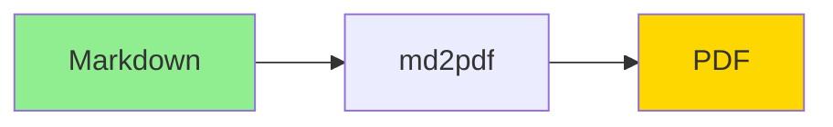

# Test Document

This is a test document for **md2pdf-mermaid** converter.

## Features Test

### Text Formatting

This paragraph has **bold text**, *italic text*, and `inline code`.

### Lists

Bullet list:
- Item 1
- Item 2
- Item 3

Numbered list:
1. First
2. Second
3. Third

### Table

| Feature | Status | Notes |
|---------|--------|-------|
| Headers | ✓ | Working |
| Tables | ✓ | Colored |
| Code | ✓ | Highlighted |

### Code Block

```python
def hello_world():
    print("Hello from md2pdf!")
    return True
```

### Mermaid Diagram



---

## Conclusion

All features tested successfully!
